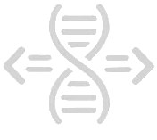

<div align="center">
  

  # TransAct
</div>

TransAct is an open data platform for forensic nucleic acid transfer research (DNA/RNA transfer). It is aimed at forensic molecular biology laboratories and research institutions that want to record, standardize, and share raw data from transfer experiments in a structured, internationally accessible way.

## Background

Forensic DNA analysis is a central tool in criminal investigations: even minimal traces of biological material can be isolated and, ideally, unambiguously attributed to a person. As the underlying methods keep advancing, however, contextualizing a DNA trace — i.e. understanding how it ended up where it was found — is becoming increasingly important. Through **DNA transfer**, genetic material can be transmitted between objects and/or persons through mere contact, meaning a person's DNA can reach a crime-relevant object or person without any connection to the offense. As a result, defense arguments in court increasingly no longer dispute the origin of an incriminating DNA trace, but rather the context of how it came about.

Reliable probability estimates for such transfer scenarios are currently very difficult to establish, not least because systematically collected, comparable raw data from transfer experiments is largely missing.

## Project goal

TransAct lays the groundwork for rationalizing forensic nucleic acid transfer research:

1. **Open platform** for collecting and providing nucleic acid transfer raw data for the international research community.
2. **Standardized experiments** to characterize non-transfer-related variability and establish comparability between laboratories.
3. **Initial datasets** for relevant transfer scenarios, used to populate and validate the database.
4. **Systematization of RNA transfer research** as a complementary research field.

In the long term, TransAct aims to provide a sustainable and extensible foundation for the systematic organization of research results on forensic nucleic acid transfer and activity-level crime scene reconstruction — paving the way toward routine forensic use, and opening up space for further research and teaching.

## Stack

| Area     | Technology                                                                                                   |
| -------- | ------------------------------------------------------------------------------------------------------------ |
| Backend  | Python 3.12, FastAPI, SQLAlchemy 2, Alembic, PostgreSQL, [uv](https://docs.astral.sh/uv/) as package manager |
| Frontend | Vue 3, Vite, TypeScript, Pinia, Vue Router, PrimeVue, Tailwind CSS                                           |
| Auth     | JWT (cookie-based) plus WebAuthn/passkeys                                                                    |
| Other    | Alembic migrations, SMTP for transactional emails, GeoJSON/Geopandas for geographic data                     |

The backend lives under [backend/](backend/), the frontend under [frontend/](frontend/).

## Quickstart (local development)

**Backend**

```sh
uv sync
uv run --directory backend alembic upgrade head
uv run --directory backend fastapi dev app/main.py
```

**Frontend**

```sh
cd frontend
npm install
npm run dev
```

For deployment details and required environment variables, see [docs/DEPLOYMENT.md](docs/DEPLOYMENT.md).

## Development status

The current development status and planned next steps are documented in [docs/ROADMAP.md](docs/ROADMAP.md).
